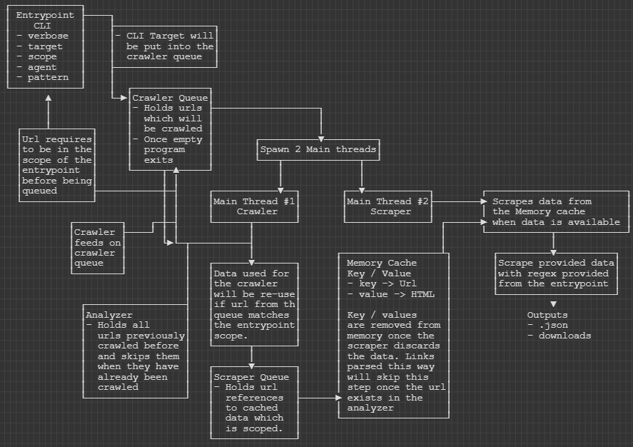

# Scraper

```
.\Scraper.exe -t "https://oldschool.runescape.wiki/" -s "runescape.wiki;/" -p "(\b(http|ftp|https):(\/\/|\\\\)[\w\-_]+(\.[\w\-_]+)+([\w\-\.,@?^=%&:/~\+#]*[\w\-\@?^=%&/~\+#])?|\bwww\.[^\s])" -v
```


